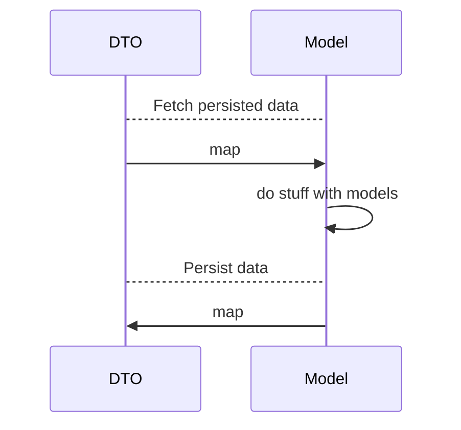


# Realm Ready

This repo covers a basic implementation for RealmSwift in the iOS-starter-kit.
The main purpose is to offer a fast -yet efficient- implementation for RealmSwift; for any further informations, please check the [official Realm Documentation](https://www.realm.io/docs/swift/latest/).

## Installation

Add `pod 'RealmSwift','~> 3.3.1'` in your Podfile and make the magic happen (`pod install`).

## Examples

The examples files can easily be added to your project; to do that :

- Download the files as a .zip
- Extract them
- 

## Models

Models will be persisted as DTOs. 



## Queries

sqd
### Filter

You can filter 
Please check the [NSPredicate Cheatsheet](https://academy.realm.io/posts/nspredicate-cheatsheet/).

 ```Swift
var itemRDtos = realm.objects(ItemRDto.self).filter("title = 'example' AND description BEGINSWITH 'I'")
```

[For more information](https://www.realm.io/docs/swift/latest/#filtering)
### Sorting

You can sort 

 ```Swift
var sortedItemRDtos = itemRDtos.sorted(byKeyPath: "title")
```

[For more information](https://www.realm.io/docs/swift/latest/#sorting)

