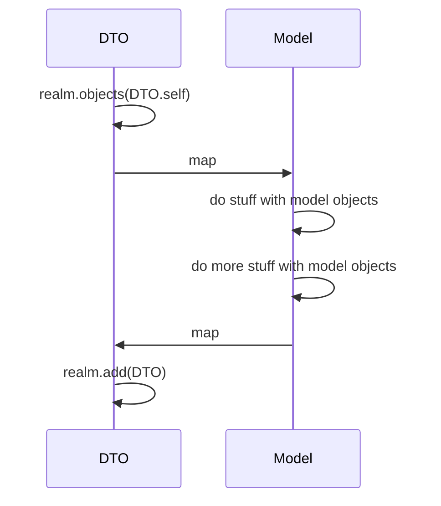


# Realm Ready

This repo covers a basic ready-to-go implementation of RealmSwift in the iOS-starter-kit.

The main purpose is to offer a fast -yet efficient- implementation of the persistance feature in the starter kit; for any further information, please check the [official Realm Documentation](https://www.realm.io/docs/swift/latest/).

## Installation

Add `pod 'RealmSwift','~> 3.3.1'` in your Podfile and make the magic happen (`pod install`).

## Examples

- **DataManager**
- *Realm*
	- **RProvider**
	- *mapper*
		- **ItemRMapper**
	- *dto*
		- **ItemRDto**

> R will now stand for Realm, AF for Alamofire.
> ItemDto : `ItemRDto` / `ItemAFDto`

The example files can easily be added to your project; to do that just download the files (`Clone or download` -> `Download ZIP`). 

It will show you the implementation for fetching / saving and clearing data. From now on you're ready to go.

## Models

Models will be persisted as DTOs. 



>Persisting objects (DTOs) must subclass **`Object`**

>Realm model properties must have the **`@objc dynamic var`** attribute to become accessors for the underlying database data.

Please refer to this [Realm property cheatsheet](https://www.realm.io/docs/swift/latest/#property-cheatsheet).

## Queries

 ```Swift
let itemRDtos = realm.objects(ItemRDto.self) //this will not load the fetched objects into memory
```
>All queries (including queries and property access) are lazy in Realm. Data is only read when the properties are accessed.

### Filter

Please check the [NSPredicate Cheatsheet](https://academy.realm.io/posts/nspredicate-cheatsheet/) for the predicate string syntax.

 ```Swift
var filteredItemRDtos = itemRDtos.filter("title = 'example' AND description BEGINSWITH 'I'")
```

[More information](https://www.realm.io/docs/swift/latest/#filtering)

### Sorting

 ```Swift
var sortedItemRDtos = itemRDtos.sorted(byKeyPath: "title", ascending: true)
```

[More information](https://www.realm.io/docs/swift/latest/#sorting)


## Useful quick tips

- **Always** set a primary key for any DTO model you are going to use.
 ```Swift
	override static func primaryKey() -> String? {
		return "id"
	}
```
Realm will update the existing stored data with the new ones by looking for the primary key.

> Without this, you will have to delete all the persisted data and then persist the new ones; huge performance costs.

- **Always** force `update: true` when updating/saving persisted data.
 ```Swift
	try realm.write {
		realm.add(dto, update: true)
	}
```
This will update existing `dto` objects in the database, looked up by its primary key. If it does not exist, it will be created and added to the database.


- Delete the Realm file from disk

 ```Swift
	do {
		try FileManager.default.removeItem(at: Realm.Configuration.defaultConfiguration.fileURL!)
	} catch {}
```

[More information about deleting Realm files](https://www.realm.io/docs/swift/latest/#deleting-realm-files)


## Migration

[Coming soon](https://www.realm.io/docs/swift/latest/#migrations)
